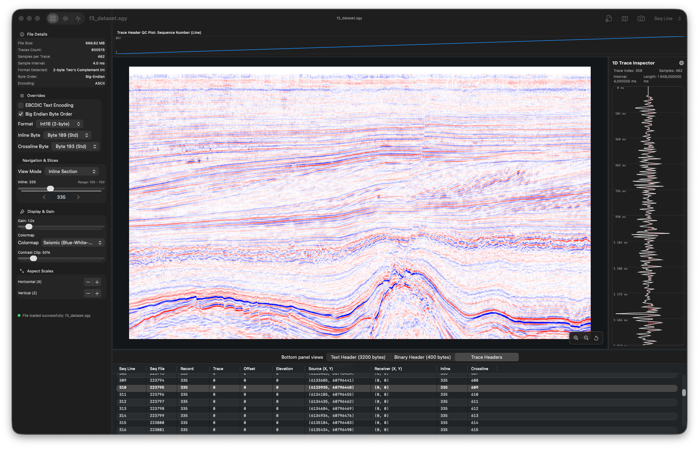

# SwiftSeis

SwiftSeis is a lightweight, native macOS viewer for 2D and 3D seismic data in the SEG-Y format. Built with Swift and Metal with a focus on performance and hardware-accelerated visualization.



## Features

*   **Memory-Mapped I/O**: Opens large SEG-Y files efficiently without loading the entire dataset into RAM.
*   **Hardware-Accelerated Rendering**: Uses Metal to draw Variable Density and Wiggle Trace overlays smoothly.
*   **3D Volume Support**: Navigate through 3D seismic cubes using an interactive 3D bounding box to view Inline, Crossline, and Z-Slice planes simultaneously, with adjustable vertical stretch.
*   **Header & Trace Inspection**: Examine textual headers (EBCDIC/ASCII), binary headers, and individual trace values.
*   **Survey Map**: A 2D minimap projection of the survey geometry, showing the current line.
*   **Navigation & Export**: Smooth zooming and panning controls, and the ability to export high-resolution screenshots of the currently viewed line.
*   **Coordinate Auto-Detection**: Automatically identifies common inline/crossline byte offsets (e.g., standard SEG-Y, Landmark/Petrel).

## Getting Started

### Using Pre-built Releases
You can download the latest compiled `SwiftSeis.app` from the [Releases page](https://github.com/olxxi/SwiftSeis/releases/).

If you downloaded the compiled bundle:
1.  Drag the `SwiftSeis.app` into your `/Applications` folder.
2.  *Note on Gatekeeper*: Because the release binary is ad-hoc signed, macOS might prompt you upon first launch. 
    *   **Right-click** the app icon and choose **Open**, then confirm in the dialog.
    *   Alternatively, clear the quarantine flag via Terminal:
        ```bash
        xattr -cr /Applications/SwiftSeis.app
        ```

### Building from Source
To compile the project manually:
1.  **Requirements**: macOS Sonoma (14.0) or higher, and Xcode Command Line Tools (`xcode-select --install`).
2.  Clone the repository.
3.  In Terminal, navigate to the project directory and run the build script:
    ```bash
    ./build.sh
    ```
4.  Launch the compiled application:
    ```bash
    open SwiftSeis.app
    ```
5.  Load any `.segy` or `.sgy` file by dragging it into the window or clicking **Select SEGY File...**.

---
